# Tutorial: A Spring Boot Kafka producer to Aiven Kafka Service

This repo provides a simple guide of Spring Boot app that produces messages to Aiven Kafka Service.  The goal here is to help you accelerate appplication development on Aiven Cloud Service using Spring Boot and VS Code.

## What you will build

You will build a simple kafka producer application sending sample messages to a kafka topic on Aiven Kafak Service. 

## What you need

- About 20 mins
- VS Code
  - Extension Pack for Java
  - Spring Initializr Java Support
  - Test Runner for Java
  - Visual Studio IntelliCode
- Aiven Cloud free account

## How to complete this tutorial

### Setup Aiven Cloud Kafka Service
1. Register a free Aiven account

   Go to https://aiven.io and register a free account. You will have 300usd credits which is enough to deploy data services we need in this tutorial. Once you registered, you can login to Aivent dashboard. The dashboard looks like this.</br>
   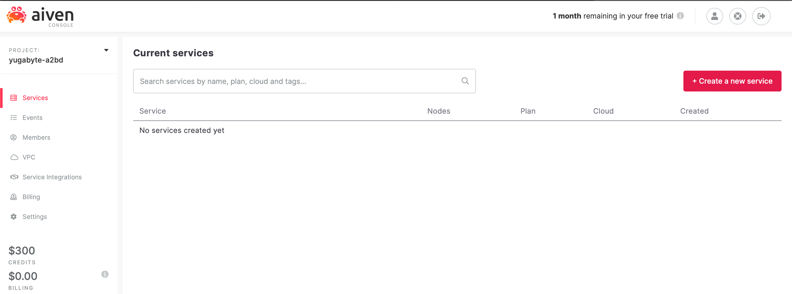
2. Create a Kafka service

   Click on **+Create a new service** and you should see a list of services available.</br>
   1. Choose Apache Kafka
      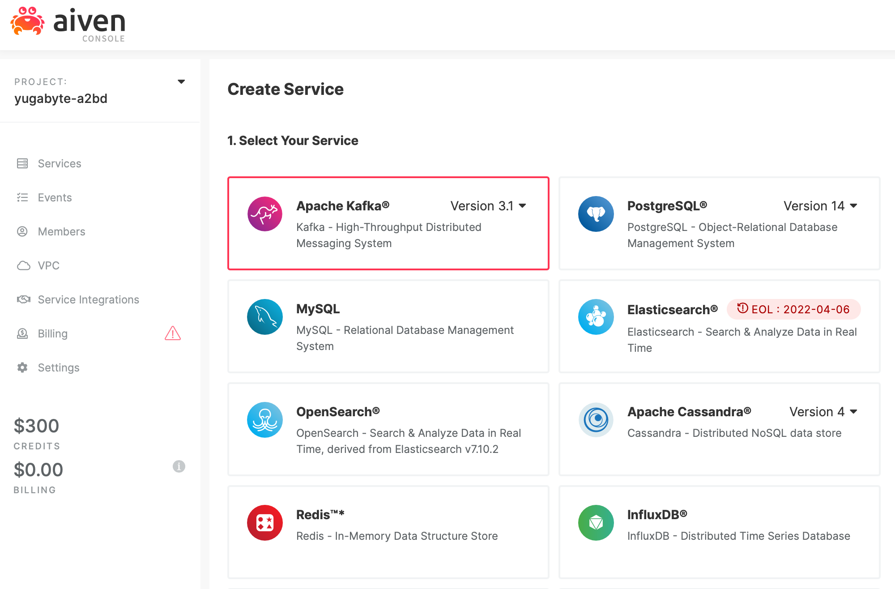
   2. Select Service Cloud Provider (Google Cloud)
      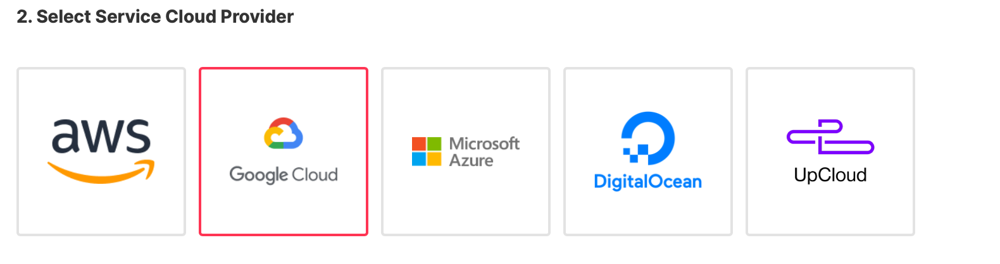
   3. Select Service Cloud Region (google-us-central1)
      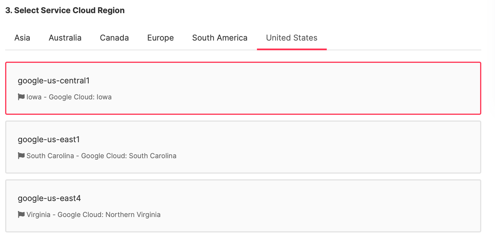
   4. Select Service Plan (for this tutorial, Startup-2 is good enough)
      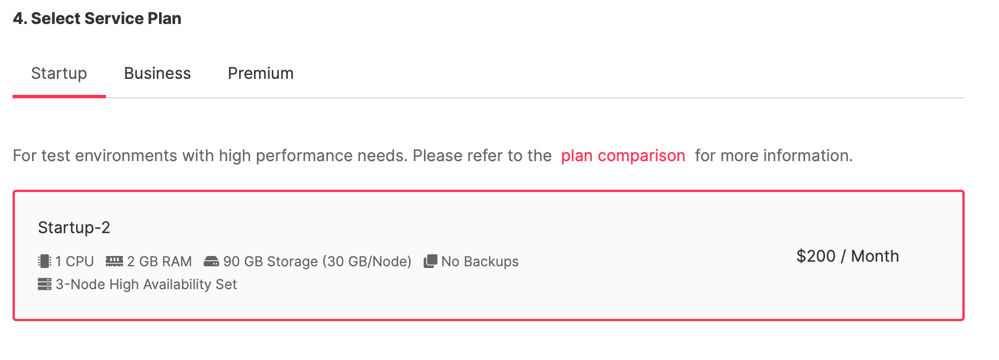
   5. Provide Service Name (optional)
      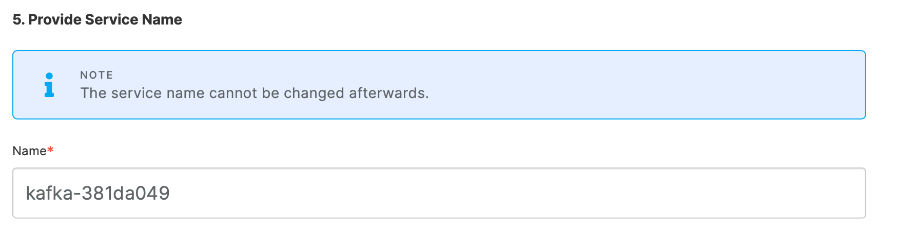
   6. In Service Summary, click **+ Create Service** to get the Kafka cluster running.
      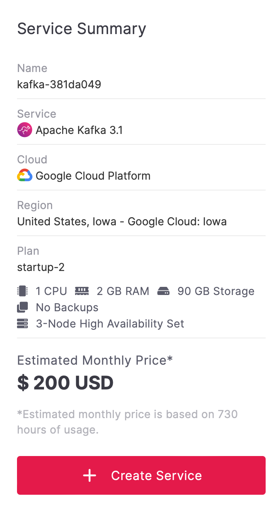
   7. You can see the Kafka service progress back in the Aiven Dashboard.
      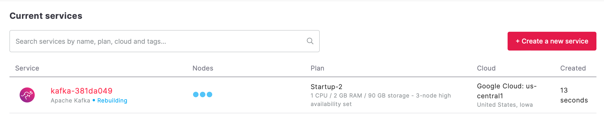

3. Create a InfluxDB and Grafana services

   From the dashboard, you can enable metrics and log integration with kafka service. Here I show InfluxDB and Grafana integration.

   1. Aiven WebUI has a good UX design, so you can create InfluxDB service and Grafana service with similar steps.
   2. Once you have InfluxDB and Grafana services, click on the **Enable Metrics Integration**, **Enable Log Integration**,  **Enable Dashboard integration** and then pick the InfluxDB and Grafana service instance respectively. Yes, it is just that easy to integrate services.
   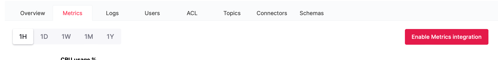
   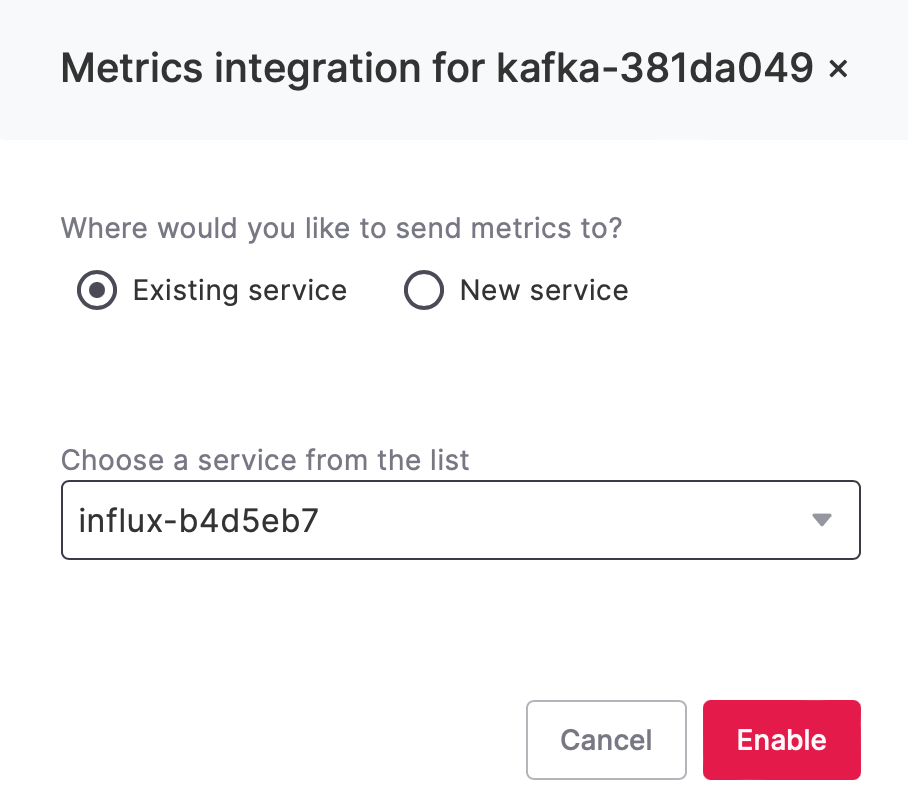

4. Grafana Dashboard
   Go to Grafana service page, you can use the username and credential to login Grafana WebUI and check the Kafka metrics. </br>
   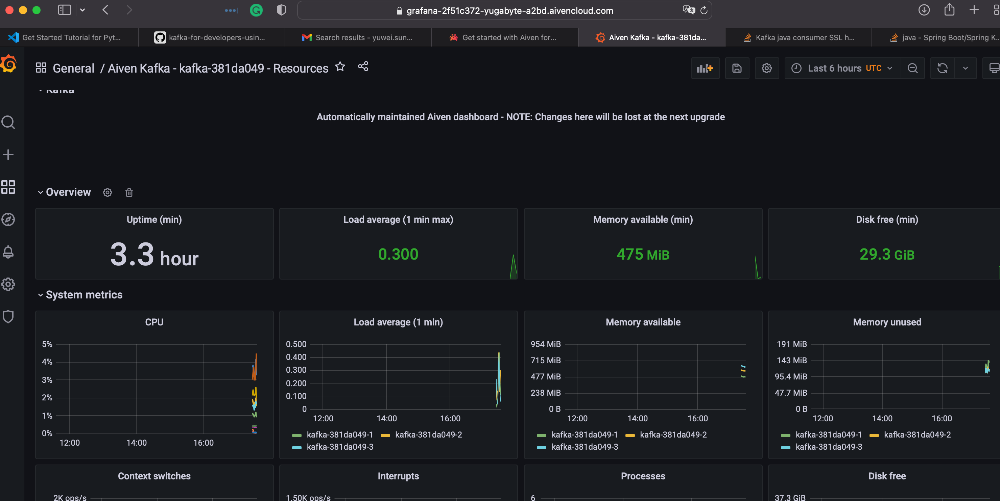

5. Kafka service access credential (cert authentication)

   For now, we are ready to switch to "dev" role and write some codes. First thing a developer needs is "access credential". You can find the info in the overview page.</br>
   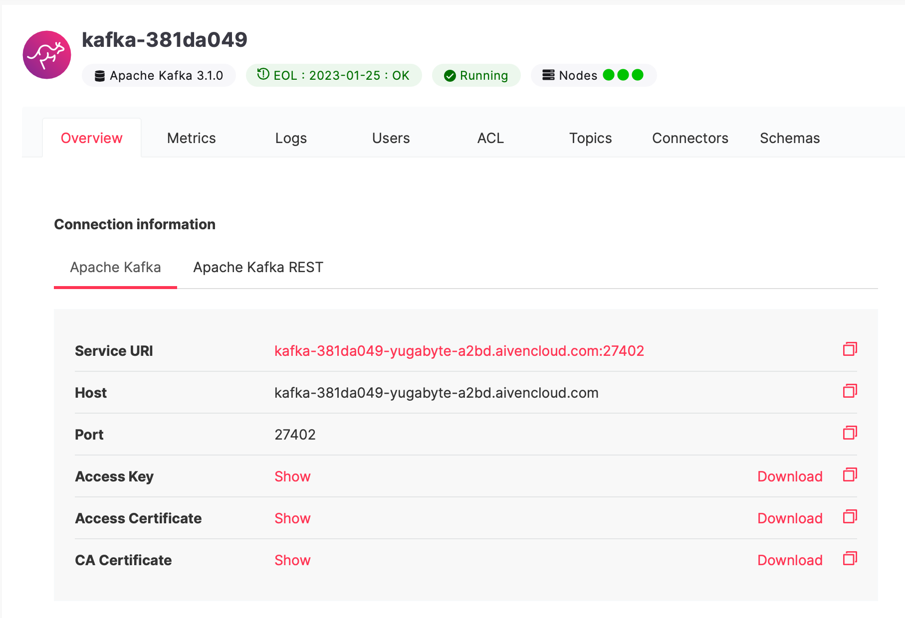
   
   In this tutorial, I demo java producer. We need to transfer the x509 certificate and CA to java keystore/truststore. Aiven Support has a [KB](https://developer.aiven.io/docs/products/kafka/howto/keystore-truststore) showing how to transfer the cert/key for java apps. 
### Spring Boot starter with kafka on VS Code

1. Create a Spring Boot project using initiator

   In VSCode, press Ctrl-Shift-P to get the command pallete, then type spring boot create gradle project, then press enter to go next step to pick spring boot starter modules. </br>
   You can find or add dependencies to build.gradle after project created. Here is an example: </br>
   ```implementation 'org.springframework.boot:spring-boot-starter'
	implementation 'org.springframework.kafka:spring-kafka'
	implementation 'com.fasterxml.jackson.core:jackson-databind'
	implementation 'com.fasterxml.jackson.dataformat:jackson-dataformat-xml'
	implementation 'com.fasterxml.jackson.datatype:jackson-datatype-jsr310'
	compileOnly 'org.projectlombok:lombok'
	developmentOnly 'org.springframework.boot:spring-boot-devtools'
	annotationProcessor 'org.projectlombok:lombok'
	testImplementation 'org.springframework.boot:spring-boot-starter-test'
	testImplementation 'org.springframework.kafka:spring-kafka-test'
   ```

2. Fill in application properties
   To simplify/flexify the demo, we add kafka configs to application.properties that spring boot application will read as context. </br>
   Note that the default broker access protocol in Aiven Kafka is SSL and spring boot default is PLAINTEXT.
   ```spring.kafka.bootstrap-servers=kafka-381da049-yugabyte-a2bd.aivencloud.com:27402
    spring.kafka.producer.retries=0
    spring.kafka.producer.acks=all
    spring.kafka.producer.value-serializer=org.springframework.kafka.support.serializer.JsonSerializer
    spring.kafka.producer.key-serializer=org.apache.kafka.common.serialization.StringSerializer
    spring.kafka.properties.spring.json.trusted.packages=*
    spring.kafka.ssl.trust-store-location=client.truststore.jks
    spring.kafka.ssl.trust-store-password=changeme
    spring.kafka.ssl.key-store-location=client.keystore.p12
    spring.kafka.ssl.key-store-password=changeme
    spring.kafka.ssl.protocol=SSL
    spring.kafka.properties.ssl.endpoint.identification.algorithm=
    spring.kafka.properties.security.protocol=SSL
   ```

3. Define model class

4. Use kafka template in Spring Boot application runner

5. Troubleshootings

### Check topic content on Aiven web

1. Go to Aiven dashboard -> Kafka service -> Topics -> Topic => **Fetch Message** (Format: binary)

2. You should see the base64 encoded keys and messages. Click on base64 decode to check the content.

3. You can also check (format: json) and **Fetch Message**. It triggered an internal error from the WebUI. I checked the log and found that the **Fetch Message** is using python kafka consumer to get the json content. I guess python consumer cannot deserialize the json message I use in Spring Boot.
### Next: consume (test) and json schema

1. Create a kafka consume in spring boot app and make sure spring boot app can ser/de the json message.
2. Use schema server to help json schema.
